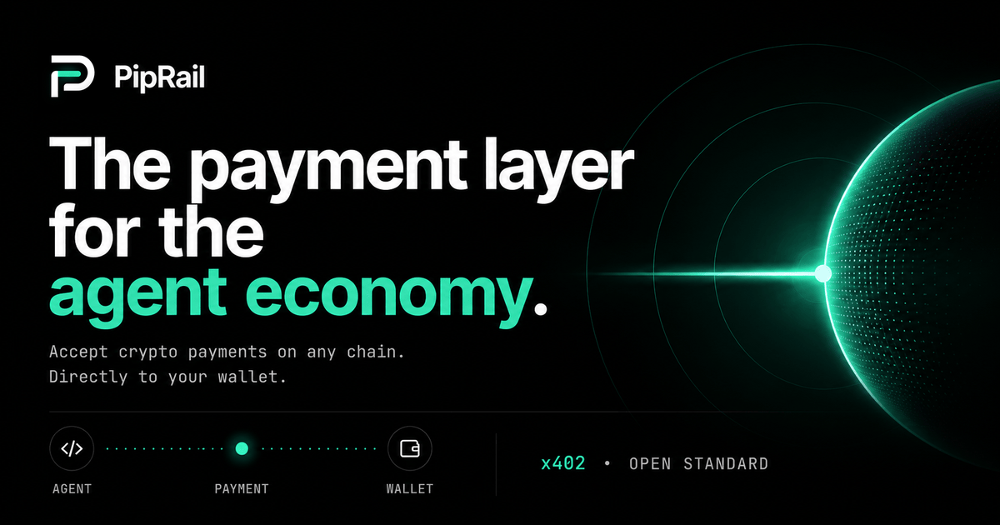
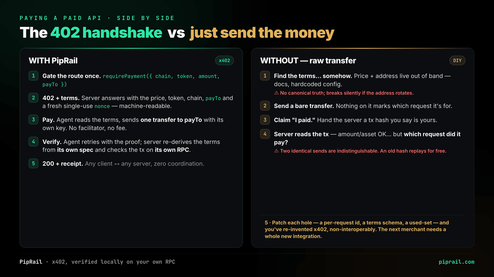
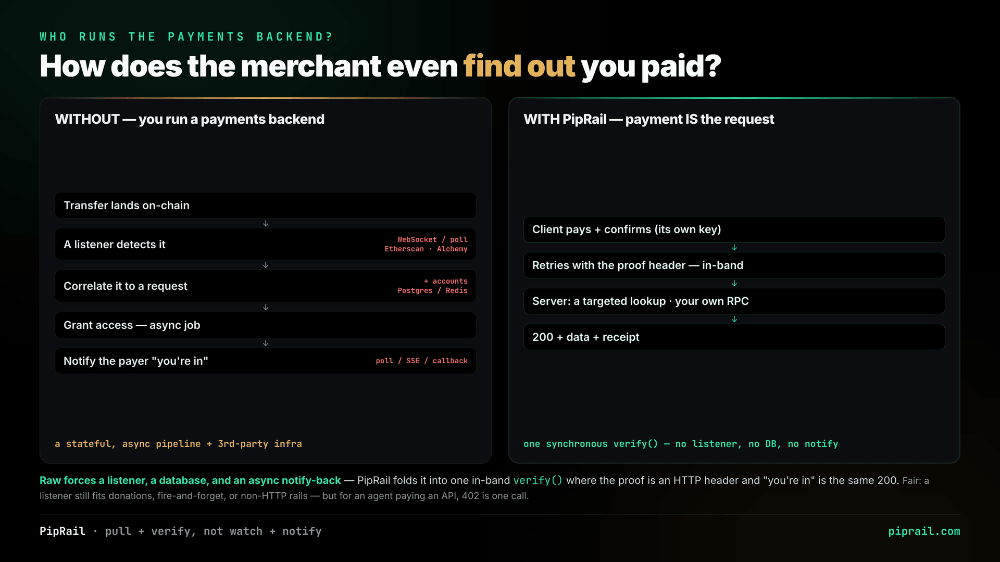
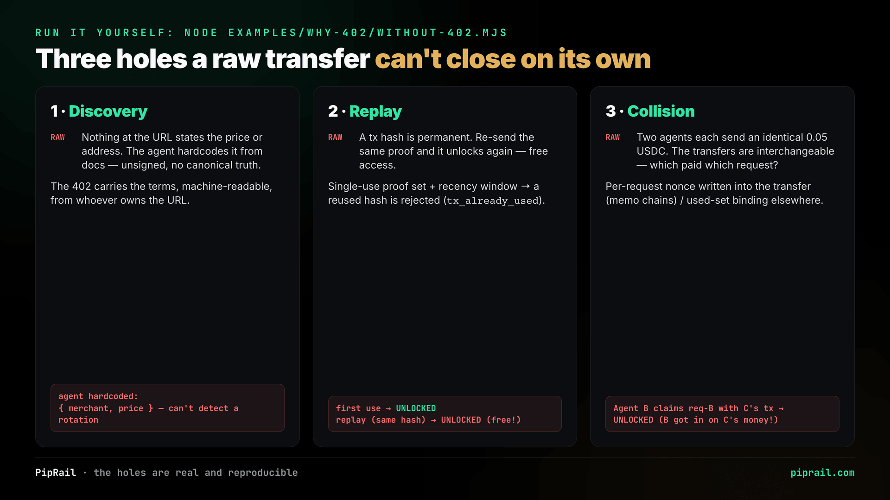
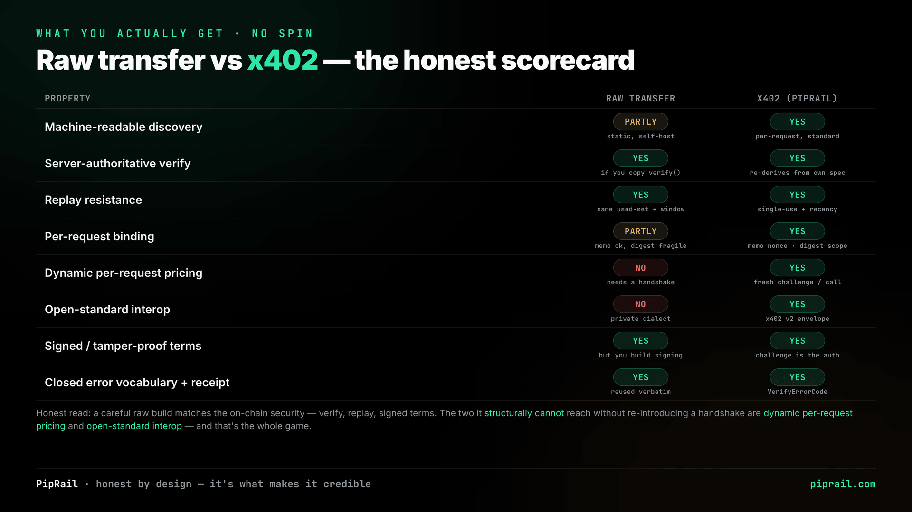
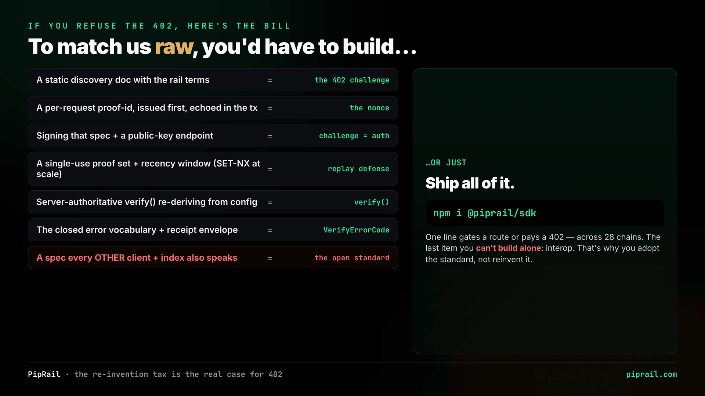
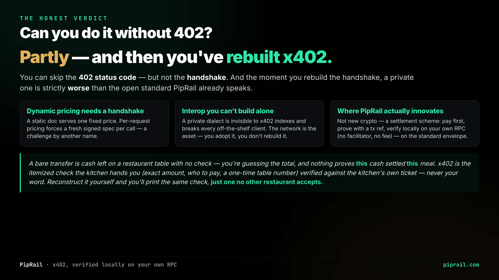
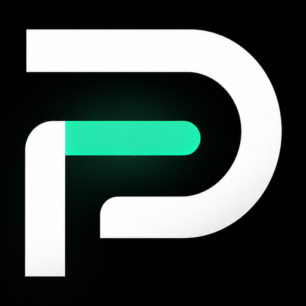

<div align="center">



<br/>
<br/>

[](https://www.npmjs.com/package/@piprail/sdk)
[](https://www.npmjs.com/package/@piprail/mcp)
[](https://www.npmjs.com/package/@piprail/sdk)
[](LICENSE)
[](https://x402.org)
[](#-supported-chains)

**Let any HTTP endpoint charge for itself, and any agent pay for itself — across 29 chains, in a couple of lines.**

[Website](https://piprail.com) · [Documentation](https://docs.piprail.com) · [npm](https://www.npmjs.com/package/@piprail/sdk)

</div>

---

`@piprail/sdk` implements the open [x402](https://x402.org) **"402 Payment Required"** standard with **no backend, no database, no account, and no fee**. Payments settle **straight into your wallet**, verified locally against your own RPC — across every major EVM chain plus **Solana, TON, Tron, NEAR, Sui, Aptos, Algorand, Stellar & the XRP Ledger**.

```bash
npm install @piprail/sdk viem
```

> 📖 **Full documentation → [docs.piprail.com](https://docs.piprail.com)** — the single, searchable source of truth for every function, option, chain, and example, plus the MCP server, spend controls, and the complete error model. This README is the tour.

### 💸 Charge for an endpoint

```ts
import { requirePayment } from '@piprail/sdk'

app.get('/report',
  requirePayment({ chain: 'base', token: 'USDC', amount: '0.05', payTo: '0xYourWallet…' }),
  (_req, res) => res.json({ report: 'TOP SECRET' }),
)
```

That route now costs **0.05 USDC on Base**, paid straight to your wallet. The first request gets a `402` with payment instructions; once the caller pays on-chain, it goes through. One parameter picks the chain.

### 🤖 Let an agent pay for it

```ts
import { PipRailClient } from '@piprail/sdk'

const client = new PipRailClient({ chain: 'base', wallet: { privateKey: process.env.AGENT_KEY } })

// Hits a 402, pays it on-chain, waits for confirmation, retries with proof — automatically.
const res = await client.fetch('https://api.example.com/report')
```

The same app can **take** payments and **make** them. Built for autonomous agents: install, add a wallet, monetize or pay — nothing else to wire up.

### 🔌 …or hand any AI agent a wallet — no code

[`@piprail/mcp`](https://www.npmjs.com/package/@piprail/mcp) is an [MCP](https://modelcontextprotocol.io) server that gives Claude Desktop, Cursor, Claude Code, Windsurf, VS Code, or Cline a budget-bound wallet. Add one block to your client config and the agent pays, discovers, and registers x402 URLs on its own — capped by a spend policy it **cannot exceed**:

```jsonc
{ "mcpServers": { "piprail": {
  "command": "npx", "args": ["-y", "@piprail/mcp"],
  "env": { "PIPRAIL_PRIVATE_KEY": "0x…", "PIPRAIL_CHAIN": "base", "PIPRAIL_MAX_AMOUNT": "0.10" } } } }
```

Seven tools appear — `piprail_discover`, `piprail_quote_payment`, `piprail_plan_payment`, `piprail_pay_request`, `piprail_register`, `piprail_budget`, `piprail_guide`. Runs locally with your key; no backend, no custody. → [MCP docs](https://docs.piprail.com/mcp/overview/)

### 🧭 Be discoverable — get found, find others

A 402 endpoint is payable, but nobody can *find* it. PipRail closes that gap with **$0, no backend** — built on the open x402 indexes (402 Index, CDP Bazaar), nothing PipRail-hosted:

```ts
await client.register('https://api.example.com/report', { name: 'Market Report', priceUsd: 0.05 })
const hits = await client.discover({ query: 'market data' }) // find payable APIs to use
```

Emit a machine-readable manifest (`buildOpenApi` / `buildWellKnownX402` / `buildX402DnsTxt`), register on the open indexes (no auth, any chain), and discover resources to pay. → [Discovery docs](https://docs.piprail.com/discovery/discover-and-register/)

## 🌐 Supported chains

**29 chains across 10 families** — name one with a single `chain:` parameter. Non-EVM families lazy-load on first use, so a pure-EVM install never downloads their libraries.

| Family | Built-in chains | Tokens |
|---|---|---|
| **EVM** (19) | Ethereum · Base · Arbitrum · Optimism · Polygon · BNB · Avalanche · Mantle · Sonic · Linea · Scroll · Celo · zkSync · Unichain · World Chain · Sei · Injective · HyperEVM · Monad | USDC + USDT* |
| **Solana** | Solana | USDC · USDT |
| **TON** | The Open Network | USD₮ |
| **Tron** | Tron | USD₮ |
| **NEAR** | NEAR | USDC · USDT |
| **Sui** | Sui | USDC |
| **Aptos** | Aptos | USDC · USDT |
| **Algorand** | Algorand | USDC |
| **Stellar** | Stellar | USDC · EURC |
| **XRP Ledger** | XRPL | USDC · RLUSD |

<sub>\*USDC on every EVM chain; USDT on all of them except Base, World Chain, Sei, HyperEVM, and Monad (their "USDT" is USDT0/LayerZero, not Tether-native — omitted). Any other EVM chain works via a viem `Chain` or `{ id, rpcUrl }` — no allowlist. Every token address was verified on-chain before shipping.</sub>

## ✨ Why PipRail

Anything should be able to charge for itself — an API, a dataset, a model, an agent — and **anyone** should be able to get paid for it in seconds, without asking a platform for permission. The agent economy will run on millions of tiny, machine-to-machine payments, and that rail should be **open, free, and self-custodial** — not a toll booth owned by a middleman.

So we built it that way: no backend, no fees, no gatekeeper — an MIT library that turns any endpoint into a paid one and any agent into a paying customer, on every major chain. The goal is simple and audacious: **make open, self-custodial payments the default rail for the agent economy.**

## ⚙️ How it works

```
Agent                                  Your server
  │  GET /report                            │
  │ ───────────────────────────────────────►│  requirePayment
  │ ◄──────────── 402 + payment-required ────│  (issues a challenge)
  │  pay on-chain (one transfer to payTo)    │
  │ ───────────────────►  [the chain]        │
  │  GET /report  + payment-signature        │
  │ ───────────────────────────────────────►│  verifies the tx against
  │ ◄──────────── 200 + your content ────────│  its own RPC, then next()
```

Verification is local and confirms the transaction **succeeded, is recent, and actually moved the required amount of the right token to `payTo`**. The x402 v2 spec (§7) explicitly endorses merchant-local verification — no facilitator required — so this is a spec-compliant shape, not a workaround. **Self-custody throughout:** the payer signs and broadcasts their own transfer straight to your wallet; PipRail never holds funds and never takes a cut.

## 🔬 Why 402, and not just a raw transfer?

> *"The payer signs and broadcasts their own transfer straight to your wallet — so why do we need x402 at all?"*

Fair question, and we answer it honestly — we even tried to **break our own method**. A bare transfer moves money, but it doesn't make a payment *usable*: the caller can't discover the price at the URL, the server can't tell **which request** a transfer paid for, can't stop replays, and has to run a whole **payments backend** (a chain listener, a correlation/accounts store, an async notify-back — usually leaning on Etherscan/Alchemy) just to notice the payment landed. x402 collapses all of that into one synchronous, in-band `verify()` — the proof is an HTTP header, and *"you're in"* is the same `200`.

<p align="center"></p>

<p align="center"></p>

<p align="center"></p>

<p align="center"></p>

<p align="center"></p>

<p align="center"></p>

**The honest bottom line:** a careful raw build *can* reach most of the on-chain security — *if it rebuilds the handshake itself*. The two things it structurally **cannot** get are **dynamic per-request pricing** and **open-standard interop**. And the moment you rebuild the handshake, a private one is strictly worse than the open standard PipRail already speaks.

→ **Run it yourself:** [`examples/why-402/`](examples/why-402/) — [`without-402.mjs`](examples/why-402/without-402.mjs) prints the holes live, [`without-402-server.mjs`](examples/why-402/without-402-server.mjs) sketches the backend you'd otherwise run, and [`with-402.mjs`](examples/why-402/with-402.mjs) is the SDK. Full write-up + **honest limitations** in the [why-402 README](examples/why-402/README.md).

> 🤝 **Think we're wrong? Please try.** We'd genuinely like to be challenged on this. If you can get x402's full behaviour — discovery, dynamic per-request pricing, and cross-merchant interop — out of a raw transfer **without** rebuilding the handshake, [**open an issue**](https://github.com/piprail/piprail/issues) and show us. We'll happily update the comparison. We even ship our own [honest limitations](examples/why-402/README.md#honest-limitations-read-before-production) — scrutiny only makes the case stronger.

## 📦 What's in here

```
piprail/
├── sdk/         # @piprail/sdk — the core SDK (the product)            → published to npm
├── mcp/         # @piprail/mcp — the MCP server wrapping the SDK        → published to npm
├── site/        # piprail.com — the landing site (Astro 5 + Tailwind v4, deploys to Netlify)
├── examples/    # runnable merchant + agent demos + a live Anvil end-to-end
└── .github/     # CI: build/test checks · npm publish on sdk-v* / mcp-v* tags
```

**Two packages are published to npm:** [`@piprail/sdk`](https://www.npmjs.com/package/@piprail/sdk) (the
core library) and [`@piprail/mcp`](https://www.npmjs.com/package/@piprail/mcp) (the MCP server, also
listed in the [MCP registry](https://registry.modelcontextprotocol.io) as `io.github.piprail/mcp`).
`site/` is the source of [piprail.com](https://piprail.com); `examples/` holds runnable demos — both
live here in the repo but aren't published.

→ Full API, guides & reference: **[docs.piprail.com](https://docs.piprail.com)** — the complete, searchable documentation for the SDK + MCP (the source of truth).

No `contracts/`, no server, no database. PipRail is a tool you install, not a platform you sign up for.

## 🛠️ Quick start

```bash
npm install              # install workspace deps

npm run build:sdk        # build the SDK   (build it before the MCP — the MCP imports its dist)
npm run test:sdk         # run the SDK test suite
npm run build:mcp        # build the MCP server
npm run test:mcp         # run the MCP test suite
npm run typecheck        # typecheck the SDK + MCP

npm run dev              # run the landing site → http://localhost:4321
```

**Live, end-to-end proofs** (real published packages, no mocks) live in [`examples/`](examples):
`node run-all.mjs` in [`examples/sdk-sandbox`](examples/sdk-sandbox) (the gate, client, policy, a real
on-chain round-trip on a local Anvil fork, **and live discovery**) or [`examples/mcp-sandbox`](examples/mcp-sandbox)
(the MCP server attacked as a greedy AI). A runnable [`examples/discovery`](examples/discovery) calls
`emit` / `register` / `discover` against the real open indexes.

Releasing a new version? See **[RELEASING.md](RELEASING.md)** — the publish is tag-driven CI, and a build-time guard keeps the site's docs in sync with the packages.

## 📄 License & trademark

**Code:** [MIT](LICENSE) — use it, fork it, ship it, commercially or otherwise.

**Name & brand:** **PipRail™**, the logo, and the `@piprail` npm scope are trademarks of the PipRail project — MIT covers the *code*, not the *name*. Build on it freely; just don't call a fork "PipRail" or imply it's official. See [TRADEMARK.md](TRADEMARK.md).

Contributions welcome — see [CONTRIBUTING.md](CONTRIBUTING.md) (a simple DCO sign-off, no CLA).

<div align="center">
<br/>


<sub>Built for the agent economy · <a href="https://piprail.com">piprail.com</a></sub>
</div>
